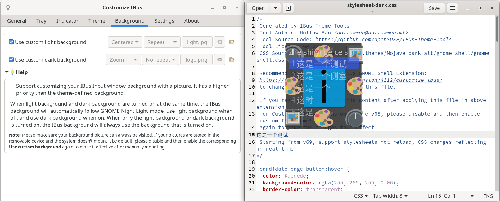
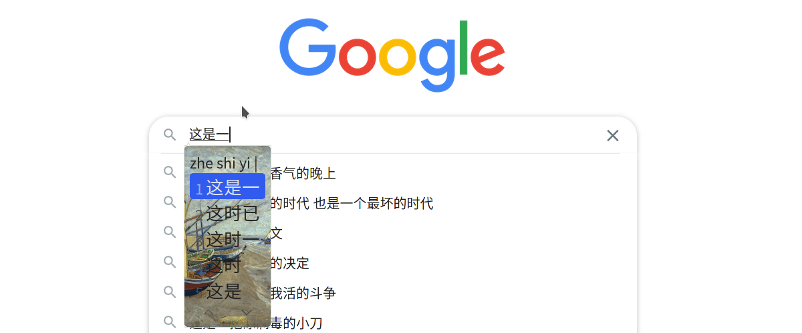
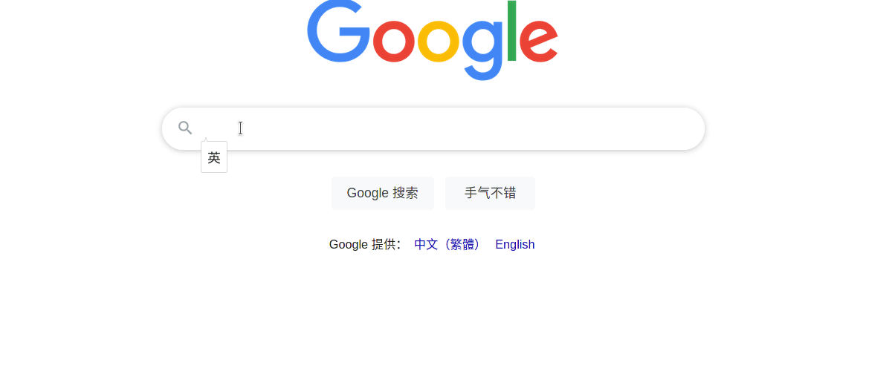

# Customize IBus

[](https://github.com/openSUSE/Customize-IBus/graphs/commit-activity)
[](../../releases)

[](https://opensource.org/licenses/GPL-3.0/)
[](https://github.com/openSUSE/Customize-IBus/archive/main.zip)

[](https://lgtm.com/projects/g/openSUSE/Customize-IBus/alerts/)
[](https://lgtm.com/projects/g/openSUSE/Customize-IBus/context:javascript)

[中文 Chinese](README_CN.md)

Full customization of appearance, behavior, system tray and input source indicator for IBus.

[Customize IBus User Guide](https://translate.google.com/translate?sl=zh-CN&tl=en&u=https://github.com/openSUSE/Customize-IBus/blob/main/GUIDE_CN.md)



## Installation

[][ego]

Or manually:

```bash
git clone https://github.com/openSUSE/Customize-IBus.git
cd Customize-IBus && make install
```

If you use Arch Linux, you can also use AUR to install as a system extension:

```bash
yay -S gnome-shell-extension-customize-ibus
```

[](https://aur.archlinux.org/packages/gnome-shell-extension-customize-ibus/)

You can also use RPM Repository to install as a system extension under [Fedora](../../tree/package-repo#fedora):

```bash
wget https://github.com/openSUSE/Customize-IBus/raw/package-repo/customize-ibus-rpm.repo
sudo mv customize-ibus-rpm.repo /etc/yum.repos.d/
sudo dnf update
sudo dnf install gnome-shell-extension-customize-ibus
```

You can also use RPM Repository to install as a system extension under [OpenSUSE](../../tree/package-repo#opensuse):

```bash
wget https://github.com/openSUSE/Customize-IBus/raw/package-repo/customize-ibus-rpm.repo
sudo mv customize-ibus-rpm.repo /etc/zypp/repos.d/
sudo zypper refresh
sudo zypper install gnome-shell-extension-customize-ibus
```

Or directly use [ymp file](gnome-shell-extension-customize-ibus.ymp) to install.

You can also use Debian Repository to install as a system extension under [Debian (Ubuntu)](../../tree/package-repo#debianubuntu):

```bash
echo "deb https://hollowman.ml/Customize-IBus/deb/ /" | sudo tee -a /etc/apt/sources.list.d/customize-ibus-deb.list > /dev/null
wget -q -O - https://hollowman.ml/Customize-IBus/hollowman.pgp | sudo apt-key add -
sudo apt update
sudo apt install gnome-shell-extension-customize-ibus
```

All versions of Linux can download related packages through [OpenSUSE OBS](https://software.opensuse.org//download.html?project=home%3Ahollowman&package=gnome-shell-extension-customize-ibus) and then make installation.

## Features

Support Customization of:

- Candidate Box Orientation
- Candidate Box Animation
- Right-click Candidate Box to Switch the Input Mode or Open the Tray Menu
- Scroll on Candidate Box to Switch among Pages or Candidates
- Fix Candidate Box to Not Follow the Caret and Set Fixed Position
- Candidate Box Font
- Input Mode Remember and Auto-switch by APP
- Fix IME List Order
- Drag Candidate Box to Reposition
- Show or Hide Candidate Box Page Buttons
- System Tray Menus and Interaction Settings
  - Show or Hide Tray Icon
  - Directly Click Tray Icon to Switch Input Mode
  - Add Additional Menu
- Input Source Indicator Appearance and Interaction Settings
  - Enable Indicator
  - Only Indicate when Switching Input Mode
  - Only Indicate when Using ASCII Input Mode
  - Right-click Indicator to Hide
  - Scroll on Indicator to Switch Input Mode
  - Indicator Animation
  - Customize Font
  - Left-click Indicator to Drag to Move Indicator or Switch Input Mode
  - Enable Auto-hide Indicator and Configure Auto-hide Timeout
- Theme (Stylesheet Provided or Extracted from GNOME Shell Themes, Refer to Help Instructions in Extension for More)
- Candidate Box Background and its Displaying Style
- Theme and Background Picture Follow GNOME Night Light Mode

### Input Source Indicator


### Animation

With Slide enabled:



### Drag to Reposition



### Fix IME List Order

When switching input methods, the order of indicator displaying is fixed instead of cycling from the middle.

Before:


After:


Imported from [Fixed IME List](https://extensions.gnome.org/extension/3663/fixed-ime-list/), more reasons for this feature can be found here: https://github.com/AlynxZhou/gnome-shell-extension-fixed-ime-list#why

### Realization of Customizing IBus with User Theme

This function has been separated, generating IBus theme stylesheet has been moved to [IBus-Theme](https://github.com/openSUSE/IBus-Theme).

Now this extension supports importing stylesheet generated by this tool. In addition it also supports the IBus theme stylesheets provided by [IBus-Theme-Hub](https://github.com/openSUSE/IBus-Theme-Hub).

When light theme and dark theme are turned on at the same time, the extension will automatically follow GNOME Night Light mode, use light theme when off, and use dark theme when on.

When only the light theme or dark theme is turned on, the extension will always use the theme that is turned on.

**Note:** If your IBus style sheet has changed after application, please close and reopen the corresponding `custom IME theme` to make it effective.

#### Themes in IBus Tweaker

Themes in IBus Tweaker have been converted by me as IBus theme stylesheets collection [仿微软 Microsoft](https://github.com/openSUSE/IBus-Theme-Hub/tree/main/%E4%BB%BF%E5%BE%AE%E8%BD%AFMicrosoft), you are welcomed to use it!

#### _NOTE:_

1. For users who don't use GNOME but other desktop environments like KDE, XFCE, etc., please use another project of mine [IBus-Theme](https://github.com/openSUSE/IBus-Theme) to use a different GTK theme for IBus.
2. If not for debugging, please DO NOT add any classes that's not started with `.candidate-*` into IBus stylesheet to prevent from disturbing system themes.

### Realization of Modifying IBus Background Picture

During [fixing Unity8-Wood theme and add support for IBus Background](https://github.com/openSUSE/mentoring/issues/158#issuecomment-813837436), if adding the following style for class `.candidate-popup-content`：

```css
background: url("assets/bg.png");
background-repeat: no-repeat;
background-size: cover;
```

you can modify the background picture.

Further combining [ibus-font-setting](https://extensions.gnome.org/extension/1121/ibus-font-setting/) and [background-logo](https://pagure.io/background-logo-extension), referring to GNOME-Shell's source code, there exists the [corresponding widget](https://gitlab.gnome.org/GNOME/gnome-shell/-/blob/master/js/ui/ibusCandidatePopup.js#L154) for class `candidate-popup-content`, and modified the style to realize modifying IBus background picture without restarting GNOME-Shell.

Support setting background picture displaying mode as Centered, Repeated and Zoom, and also repeat mode.

When light background and dark background are turned on at the same time, the extension will automatically follow GNOME Night Light mode, use light background when off, and use dark background when on.

When only the light background or dark background is turned on, the extension will always use the background that is turned on.

**Note:** Please make sure your background picture can always be visited. If your pictures are stored in the removable device and the system doesn't mount it by default, please close and reopen the corresponding `Use custom background` to make it effective after manually mounting.

## Changelog

- [x] Import from [ibus-tweaker](https://github.com/tuberry/ibus-tweaker) and remove features unrelated to IBus.
- [x] Read from user themes and apply only for IBus.
- [x] Merge functions related together.
- [x] V4: Update from GTK3 to GTK4 to adapt for GNOME40.
- [x] V8: Add functionality to modify IBus Background picture.
- [x] V13: Strip the current function of extracting IBus style from Gnome shell theme, implement using CSS parser libraries in Python instead of regular expression. Additional IBus style sheets are generated for users to modify and test.
- [x] V13: Modify this extension to accept IBus style sheets provided by users for style application.
- [x] V16: Modify theme load logic so that now we don't need to reload GNOME-Shell to change IBus themes.
- [x] V18: Add theme and background picture follow GNOME Night Light Mode.
- [x] V18: Refactor code.
- [x] V20: Change UI；Add Help page.
- [x] V22: Re-design UI.
- [x] V24: Add background picture displaying mode configure.
- [x] V26: Add background picture displaying repeat mode configure.
- [x] V28: Add extension prefs menu entry into IBus Input Source Indicate Panel.
- [x] V30: Add Remember Input State options.
- [x] V32: Change extension logo and UI.
- [x] V36: Add tray menu entries modifications and start/restart IBus button.
- [x] V38: Add IBus version displaying and input source indicator.
- [x] V40: Fix input source indicator BUGS, add more configs. Add IBus Input Popup Box animation customization feature.
- [x] V42: Add drag to move function.
- [x] V44: Refactor dragging to move feature to make it more robust.
- [x] V46: Fix several BUGs. Add right click to close source indicator.
- [x] V48: Add right click candidate box to switch input source. Support show or hide tray icon, directly click tray icon to switch input source.
- [x] V50: Add open menu for candidate right click, and click Input Source Indicator to switch source.
- [x] V52: Add feature for fixing candidate box.
- [x] V54: Fix support for ibus-rime of candidate box right click and indicator.
- [x] V55: Merge 3.38 into 40, make some changes for UI.
- [x] V56: UI changes. Add restoring default settings option. Clean codebase.
- [x] V57: Add feature for exporting and restoring settings from file.
- [x] V58: Add icons for opening files directly from Prefs. Change _.dconf into _.ini for configurations files.
- [x] V59: Add fix IME list order function and buttons to start official customization settings.
- [x] V60: Add customize font for indicator. Add show or hide candidate box page buttons. Improve on showing background.
- [x] V61: Add scroll on candidates box to switch among pages or candidates, scroll on indicator to switch input source.
- [x] V62: Fix settings sync problem with ibus-setup (preference).
- [x] V63: Fix to avoid tainting the GNOME Shell environment.
- [x] V64: Fix typos and indicator scroll settings control.

Tested on Fedora, OpenSUSE, Manjaro and Ubuntu, GNOME-shell [3.38](../../tree/3.38)(v3, v5, v9, v11, v14, v15, v17, v19, v21, v23, v25, v27, v29, v31, v35, v37, v39, v41, v43, v45, v47, v49, v51, v53(merged into main in later version)), 40.0(v4, v8, v10, v12, v13, v16, v18, v20, v22, v24, v26, v28, v30, v32, v36, v38, v40, v42, v44, v46, v48, v50, v52, v54), 3.38 and 40(v55, v56, v57, v58, v59, v60, v61, v62, v63, v64).

## Acknowledgements

1. [ibus-font-setting](https://extensions.gnome.org/extension/1121/ibus-font-setting/)
2. [ibus-tweaker](https://github.com/tuberry/ibus-tweaker)
3. [fixed-ime-list](https://github.com/AlynxZhou/gnome-shell-extension-fixed-ime-list)

_This project is part of the achievement of [@HollowMan6](https://github.com/HollowMan6) partipating the [Google Summer of Code 2021](https://summerofcode.withgoogle.com/projects/#5505085183885312) at [OpenSUSE](https://github.com/openSUSE/mentoring/issues/158)._

[ego]: https://extensions.gnome.org/extension/4112/customize-ibus/
